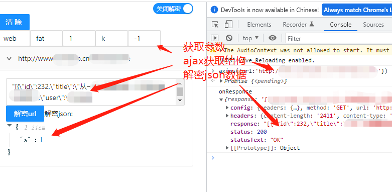

一些常用的组件库
- [在线查看效果](https://weibozzz.github.io/some-componets/)
## weixin
- [微信小程序组件库](./weixin/README.md)

## web
- [pc或者手机端组件库](./web/README.md)

## plugins
### 1.ajax-intercept

安装油猴插件，把 `ajax-intercept/index.js` 放入油猴插件即可

背景：因为要做直管展示解密的请求，所以在这里做了一个油猴插件(注意：暂时仅代理 `xmlhttprequest` 因为内部用的 `ajax-hook`)，社区有一个 [ajax-interceptor](https://github.com/YGYOOO/ajax-interceptor) `chrome` 插件，可以用该插件修改页面上 `Ajax` 请求的返回结果(支持 `fetch` 但不支持解密和直观显示页面请求)

