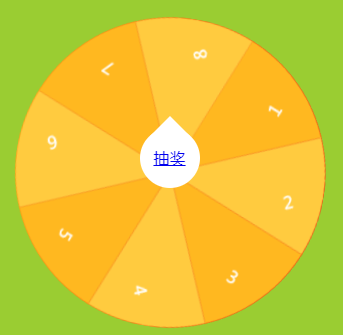

web常用的组件库

## drag
- [可滑动组件](./drag/index.html)
可滑动组件

## bigWheel
- [大转盘](./bigWheel/index.html)
css 大转盘

## sortableDrag
- [可拖拽列表](./sortableDrag/index.html)
可拖拽列表，返回变化后的排序

## play-volume
- [可拖拽列表](./play-volume/index.html)
  可点击播放在线资源，loading,播放动态

## canvas-sign
- [canvas手机端签名](./canvas-sign/index.html)

## IntersectionObserver
> 原生，可根据可见区域隐藏隐藏 dom。vue 和 react 可以封装组件，懒加载组件

- [原生示例](./IntersectionObserver/index.html)
- [vue示例](./IntersectionObserver/index-vue.html)
- [react示例](./IntersectionObserver/index-react.html)

- [文档介绍](https://weibozzz.github.io/JS/Api/IntersectionObserver.html)

